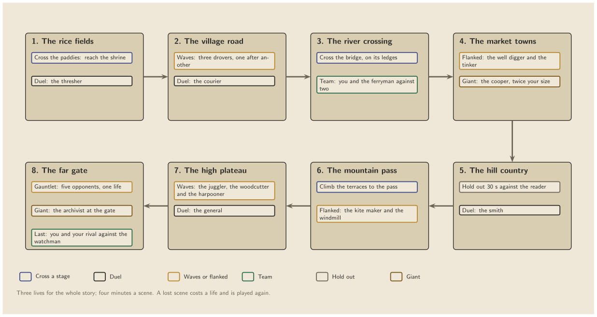
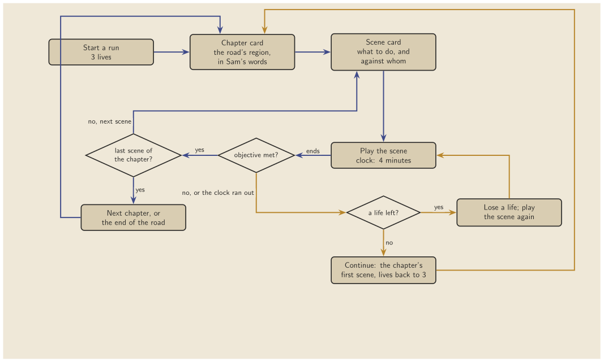
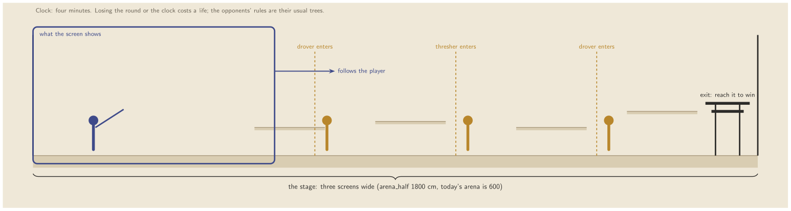
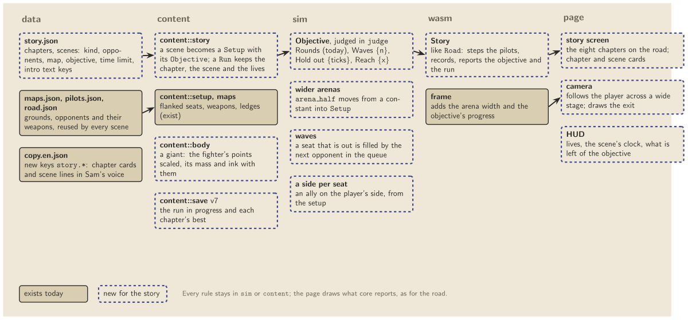

# Story mode: a proposal

Status: proposed, 2026-10-05. Nothing here is built yet. Figures are in this folder as `.tex` (TikZ, compiles with pdflatex), `.pdf` and `.png`.

## What Melee's Adventure Mode does

Super Smash Bros. Melee's Adventure Mode is a run of twelve stages. Some stages are a level to cross; most end in a match, and the matches vary: team matches, two small opponents and then a giant one, a crowd of weak opponents, a race to an exit before time runs out. Each segment has a clock (four minutes unless a stage says otherwise), and the player carries a small number of lives through the whole run, with a continue when they run out. ([Super Mario Wiki](https://mariowiki.com/Onett))

What makes it work is variety on a fixed spine: the player always moves forward through named places, and each place asks for something a little different from the fight before it.

## The proposal for Vagrancy

A story mode that walks the same road as arcade mode, in eight chapters named after its regions (the rice fields to the far gate, `road.region.*`). Each chapter is two or three scenes, about twenty in all.

### Scene kinds

| Kind | What the player does | What already exists | What is new |
|---|---|---|---|
| Duel | Beat an opponent, first to the usual rounds | everything | nothing |
| Cross a stage | Reach the exit of a stage three screens wide, past opponents who enter as you pass | ledges, pilots | wide arenas, a camera that follows the player, the Reach objective |
| Waves | Beat a set number of opponents who come one after another | flanked seats | refilling a seat that is out from a queue |
| Flanked | One opponent on each side | flanked stops | nothing |
| Team | You and an ally against two | three seats | a seat on the player's side |
| Hold out | Stay in the round for a set time against a stronger opponent | the clock | the Hold out objective |
| Giant | An opponent twice your size, with more ink | body data | scaling a body's points, mass and ink |

The giant and the waves follow Melee most closely (the giant Donkey Kong and the crowds of small opponents); the stage to cross follows its platforming levels, using the ledges the flanked fights already have.

### A run

Three lives for a whole run; four minutes on each scene's clock. Losing a scene, or running out of time, costs a life and plays the scene again. With no lives left, the run continues from the chapter's first scene with lives restored. The save keeps the run in progress and each chapter's best.

### A stage to cross

### Where it goes in the code

Every rule stays in `sim` or `content`, and the page draws what core reports, as for arcade mode.

- **`data/story.json`**: chapters and scenes. Each scene names its kind, opponents (pilot ids from `pilots.json`, so every opponent's tree is reused), map, objective, time limit, and the copy keys of its card.
- **`content::story`**: turns a scene into a `Setup` with an `Objective`, and keeps the `Run` (chapter, scene, lives). It is tested the way the road is: each scene beatable by the yardstick, each objective met by a scripted player.
- **`sim`**: an `Objective` the judge checks (Rounds as today; Waves, Hold out, Reach); the arena's half-width moves from a constant into `Setup`; a seat that is out can be refilled from a queue; a seat can be on the player's side.
- **`content::body`**: a giant, made by scaling the fighter's points, with mass and ink to match.
- **`wasm`**: a `Story` like `Road`, and the frame gains the arena width and the objective's progress.
- **page**: the story screen (the eight chapters), chapter and scene cards, a camera for wide stages, and a HUD with lives, the clock, and what is left of the objective.
- **save v7**: the run and each chapter's best.

### Order of work

1. Objectives in `sim` (Hold out, Reach, Waves) and the wider arena, each with a test that fails when the rule is broken. SIM_VERSION goes up.
2. A seat on the player's side, and giants.
3. `content::story`, `data/story.json`, save v7, and a test that the yardstick can finish every scene.
4. The page: the story screen, cards, camera and HUD; gate checks for a scene of each kind.
5. Tuning each scene with `lab rate`, and the copy, written in Sam's voice and marked for review.

## Questions to resolve

- **Name.** "Story mode", beside "Arcade mode" and "Tutorial"?
- **Lives and clock.** Three lives and four minutes a scene follow Melee; both are one constant each.
- **Rewards.** Should finishing a chapter unlock something in arcade mode (a weapon, or a fight), or should the story stand alone?
- **The last scene.** The draft ends on a team fight with "your rival", who would need a name and a pilot. Keep it, or end on the giant archivist?
- **Narration.** The chapter and scene cards need writing. The draft assumes a traveler walking the road, stated plainly, with nothing taken from the show.
